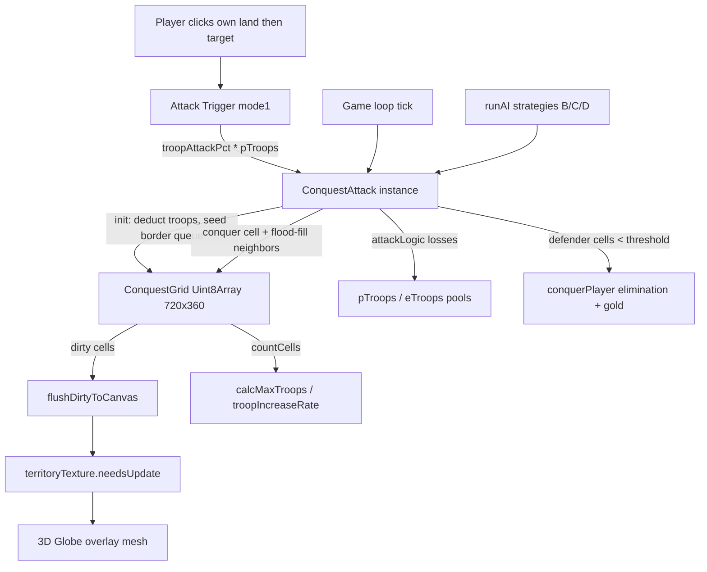

# Conquest & Occupation System — Design Plan

> Port OpenFrontIO's tile-grid conquest engine into the 3D globe game.
> Goal: faithful reproduction of OpenFront's flood-fill conquest + ratio-based combat,
> adapted to a spherical lat/lon world. Replaces the failed `PaintExpansion`/`TroopCohort` (mode1) attempts.

---

## 1. Why the previous attempts failed

| Problem | Cause |
|--------|-------|
| Severe lag during conquest | [`getPixelOwner()`](../src/main.js:789) calls `getImageData(1px)` on a 4096×2048 canvas **per flood-fill step** — thousands of slow GPU readbacks per second |
| Unreliable ownership | Territory stored as **overlapping painted circles** (`playerCoordinates` array) instead of a clean ownership grid |
| Imprecise flood-fill | Hex-stepping through continuous lat/lon (0.35° steps) drifts and misses cells |
| Ad-hoc combat | `defenderPower = totalTroops / coordList.length` — not terrain/ratio based like OpenFront |

## 2. Core idea: decouple logic grid from rendering (like OpenFront)

OpenFront separates **GameMap** (discrete tile ownership = logic) from **GameView** (rendering).
We do the same: a fast **lat/lon ownership grid** drives all conquest logic; the existing
**territory canvas texture** becomes a pure display surface that we repaint from the grid.

---

## 3. New module: `src/core/conquest.js`

### 3.1 `ConquestGrid` — the ownership + terrain grid

```
Resolution: GRID_W = 720 cols (lon, 0.5° each) × GRID_H = 360 rows (lat, 0.5° each)
            => 259,200 cells. Stored as Uint8Array (260 KB). O(1) lookups.
Cell value:  0 = water / invalid
             1 = neutral land
             2 = player
             3 = enemy
Terrain:     separate Uint8Array (0=water, 1=Plains, 2=Highland, 3=Mountain)
```

**Key methods:**
- `latLonToCell(lat, lon)` → `{col, row}` (lon wraps to [-180,180], lat clamps [-90,90])
- `cellToLatLon(col, row)` → `{lat, lon}` (cell center)
- `ownerAt(lat, lon)` / `ownerAtCell(col,row)` → fast lookup (replaces `getPixelOwner`)
- `isLandCell(col,row)`, `terrainAtCell(col,row)`
- `neighbors4(col,row)` → up to 4 orthogonal neighbors, **longitude wraps** (col 0 ↔ col 719)
- `conquer(col,row, owner)`, `countCells(owner)`
- `buildLandMaskFromCanvas(ctx, w, h)` → rasterize land from territory-canvas alpha (one-time, avoids 260k `d3.geoContains` calls)
- `buildTerrainHeuristic()` → assign Plains/Highland/Mountain from latitude bands + known mountain-range bounding boxes
- `syncToCanvas(ctx, projection, dirtyCells)` → redraw only changed cells into territory canvas; caller sets `texture.needsUpdate`

### 3.2 Terrain heuristic (user-chosen approach)

- **Plains** (mag 80): default lowland / coastal
- **Highland** (mag 100): |lat| > 45° (subarctic/tundra plateaus) OR inside highland boxes (e.g. Anatolia, Iran plateau, Inner Asia steppes)
- **Mountain** (mag 120): inside known range bounding boxes — Himalayas, Andes, Rockies, Alps, Caucasus, Zagros, Atlas, East African Rift, Urals
- Each range = `{name, minLat, maxLat, minLon, maxLon}`; a cell is Mountain if its center falls in any box; else Highland/Plains by latitude rule.

### 3.3 Combat math — faithful port of OpenFront `attackLogic` + `attackTilesPerTick`

From [`Config.ts`](../OpenFrontIO-main/src/core/configuration/Config.ts:564):

```
terrainMag:  Plains=80, Highland=100, Mountain=120
terrainSpeed: Plains=16.5, Highland=20, Mountain=25

defenderTroopLoss = defender.troops / defender.numCellsOwned      // spread across territory
ratio = clamp(defender.troops / attackTroops, 0.6, 2)
currentAttackerLoss = ratio * mag * 0.8 * largeDefenderAttackDebuff * largeAttackBonus
altAttackerLoss     = 1.3 * defenderTroopLoss * (mag/100)
attackerTroopLoss   = 0.6*currentAttackerLoss + 0.4*altAttackerLoss
tilesPerTickUsed    = clamp(defender.troops/(5*attackTroops), 0.2, 1.5) * speed * debuffs

// vs neutral (TerraNullius):
attackerTroopLoss = mag/5 (player) or mag/10 (bot)
tilesPerTickUsed  = clamp(2000*max(10,speed)/attackTroops, 5, 100)
```

```
attackTilesPerTick:
  vs player : clamp((5*attackTroops/defender.troops)*2, 0.01, 0.5) * numAdjacentEnemyCells * 3
  vs neutral: numAdjacentCells * 2
```

### 3.4 `ConquestAttack` — port of `AttackExecution`

Long-running object updated each frame in the game loop.

**State:**
- `owner`, `target` (player|enemy|neutral), `troops`, `active`
- `toConquer` — min-heap / sorted queue of frontier cells with priority (port of `addNeighbors`)
- `border` — Set of frontier cell indices

**`init()`:**
1. Deduct `attackRatio * ownerTroops` from owner pool.
2. Find owner's border cells (owner cells adjacent to target-owned cells).
3. Seed `toConquer` with target cells adjacent to those border cells, prioritized by terrain + position (port of `addNeighbors` priority formula).

**`tick()` (called from game loop, throttled):**
1. `numCellsThisTick = attackTilesPerTick(...)`.
2. Loop while budget remains & troops ≥ 1 & queue non-empty:
   - Dequeue highest-priority target cell.
g    - Verify still target-owned & still borders owner (recompute).
   - Compute `attackLogic` losses → reduce attacker troops, reduce defender pool.
   - `grid.conquer(cell, owner)`; mark dirty for render.
   - Add the cell's target-owned neighbors to border/queue (flood-fill expands).
3. If troops < 1 or queue empty → **retreat** (survivors return to owner pool, attack ends).
4. If defender cell count < threshold → **conquerPlayer** (eliminate: take all remaining cells, gold transfer).

**Priority formula (port of `addNeighbors`):**
```
mag = terrainMag(neighbor)            // 80/100/120
numOwnedByMe = count of 4-neighbors owned by attacker
priority = (rand(0..7) + 10) * (1 - numOwnedByMe*0.5 + mag/2) + tickNow
```
This makes easy cells (low terrain, many owned neighbors) conquered first — organic frontline.

---

## 4. Integration into `src/main.js`

### 4.1 Import + global grid instance
```js
import { ConquestGrid, ConquestAttack, CONQUEST_CFG } from './core/conquest.js';
let conquestGrid = null;       // initialized in initWorld for mode1
let activeAttacks = [];        // ConquestAttack instances, ticked in loop()
```

### 4.2 Replace `getPixelOwner` (line ~789)
```js
function getPixelOwner(lat, lon) {
  if (!conquestGrid) return 'neutral';
  return conquestGrid.ownerAt(lat, lon);   // 'player'|'enemy'|'neutral'
}
```
All existing callers (`checkZOC`, AI, attack trigger) keep working — now O(1).

### 4.3 Spawn phase (line ~3185, mode1 branch)
- After `initTerritory` paints countries: `conquestGrid = new ConquestGrid(); conquestGrid.buildLandMaskFromCanvas(territoryCtx, 4096, 2048); conquestGrid.buildTerrainHeuristic();`
- Seed player start: paint a cluster of cells around spawn lat/lon as player.
- Seed enemy start: same for enemy.
- `conquestGrid.syncFullToCanvas(territoryCtx, territoryProjection); territoryTexture.needsUpdate = true;`

### 4.4 Attack trigger (line ~3320, mode1 `troop_attack`)
- Replace `new TroopCohort(...)` with:
```js
let atk = new ConquestAttack({
  grid: conquestGrid, owner:'player', target: conquestGrid.ownerAt(tlat,tlon),
  troops: troopsToSend, srcLat, srcLon, dstLat, dstLon,
  onTroopsChange: (owner,delta)=>{ if(owner==='player') pTroops+=delta; else eTroops+=delta; },
  onEliminated: (conqueror,conquered)=>{ ...gold/win logic... },
  log: logEvent
});
activeAttacks.push(atk);
```

### 4.5 Game loop (line ~4244)
Add after entity updates:
```js
activeAttacks = activeAttacks.filter(a => { a.tick(); return a.active; });
if (conquestGrid && conquestGrid.dirty) {
  conquestGrid.flushDirtyToCanvas(territoryCtx, territoryProjection);
  territoryTexture.needsUpdate = true;
}
```

### 4.6 Economy (line ~245 `calcMaxTroops`)
- mode1: replace `ownedProvinces = playerCoordinates.length` with `ownedProvinces = conquestGrid.countCells('player')` (scaled, e.g. `/100`).
- Growth formula already matches OpenFront (`10 + troops^0.73/4`) — keep.

### 4.7 AI (line ~3953 `runAI`)
- Strategies B/C/D: replace `new PaintExpansion(...)`/`new TroopCohort(...)` with `new ConquestAttack(...)` targeting neutral/player cells.
- Strategy A (retaliation): same.

### 4.8 Cleanup
- Remove `PaintExpansion` class (line ~495) and `TroopCohort` mode1 branches.
- Remove `playerCoordinates`/`enemyCoordinates` circle-painting in `repaintAllCountries` (line ~1739) — grid sync replaces it.

---

## 5. Data flow



---

## 6. Files changed

| File | Change |
|------|--------|
| `src/core/conquest.js` | **NEW** — ConquestGrid, ConquestAttack, combat math, terrain heuristic, CONQUEST_CFG |
| `src/data/constants.js` | Add `CONQUEST` block (grid size, terrain mags, combat coeffs, elimination threshold) |
| `src/main.js` | Import module; init grid in spawn; replace getPixelOwner; replace attack trigger; loop ticks; economy uses cell counts; AI uses ConquestAttack; remove PaintExpansion/TroopCohort mode1 code |

## 7. Performance budget
- Grid lookup: O(1) array index (vs old per-pixel `getImageData`).
- Land mask build: one-time full `getImageData(4096×2048)` + downsample.
- Render sync: only dirty cells redrawn per frame (typically <500 during active conquest).
- Target: 60 FPS with multiple simultaneous attacks.

## 8. Open / later
- Naval/boat attacks (TransportShipExecution port) — phase 2.
- YDefense-post terrain bonus, fallout, alliances — not in scope (single-player vs AI focus).
