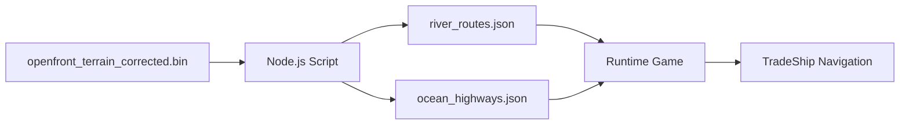
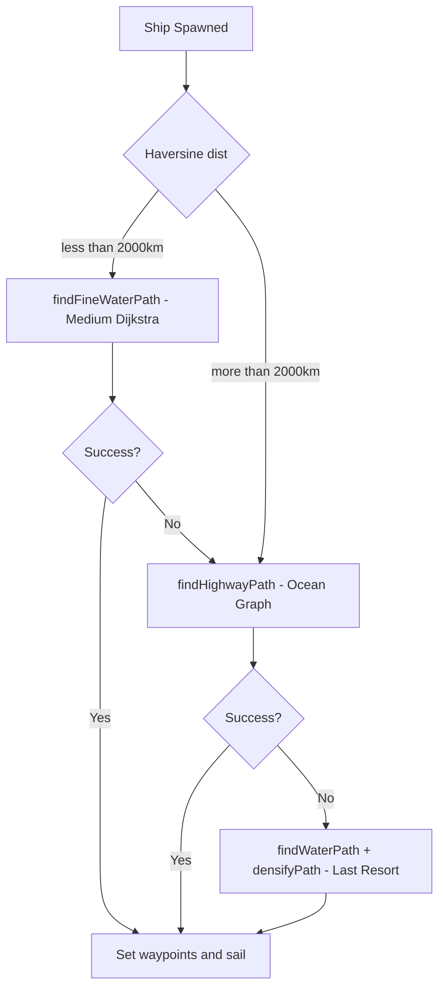

# Hybrid Maritime Pathfinding — Architecture Plan

## Problem Statement

Trade ships cross land and/or the game freezes because:
1. **Pure Dijkstra** on the medium grid (0.1°, 3600×1800) explores O(d²) cells → freezes for routes >2000km
2. **Coarse fallback** (0.5°) + `densifyPath()` can jump across land at segment boundaries
3. No pre-computed navigation data — every route computed from scratch at runtime

## Solution: Three-Tier Hierarchical Pathfinding

Pre-compute the static parts offline (river routes + ocean highway graph), use runtime
Dijkstra only for short port-to-highway connections.

### Tier 0: River Flow Field (pre-computed, offline)
For every **inland water cell** (water NOT reachable from the open ocean), store a
"next-hop" pointer toward the nearest **river mouth** (inland cell adjacent to ocean).
Following the chain from any inland cell leads to the ocean.

### Tier 1: Ocean Highway Graph (pre-computed, offline)
A sparse graph of ~8000–12000 ocean waypoints at 2° intervals. 8-connected edges
validated by Bresenham line-of-sight on the water mask (no edge crosses land).
Runtime Dijkstra on this graph is instant (<1ms for any global route).

### Tier 2: Fine Dijkstra (runtime, existing)
Short-distance port-to-highway-node connections (<200km). The existing
`findFineWaterPath()` handles this with no freezing risk.

---

## Data Flow



## TradeShip Routing Decision Tree



---

## Component 1: Offline Script — `scripts/build_river_routes.cjs`

### Step-by-step

1. **Load terrain binary** — `public/data/openfront_terrain_corrected.bin` (4108×1948 bytes, bit 7 = land)
2. **Build water mask** on medium grid (3600×1800, 0.1°) — sample terrain binary with same logic as `loadTerrainFromBin()` + `_ensureMediumArrays()`
3. **Apply dilation** — 1 ring, minNeighbors=1 (matches `CONQUEST_CFG.WATER_DILATION_RINGS`)
4. **Build ocean mask** — flood-fill from mid-Pacific seed (0°N, 160°W), 8-connected, longitude wraps
5. **Classify cells**:
   - Ocean cell = water AND in ocean mask
   - Inland cell = water AND NOT in ocean mask
   - River mouth = inland cell with ≥1 ocean neighbor (8-connected)
6. **Multi-source Dijkstra** — seed priority queue with ALL river mouths (cost=0). Expand only into inland cells. Record `parent[cell]` = next hop toward ocean.
7. **Build ocean highway graph**:
   - Sample water mask every 20 medium cells (= 2° stride) → 180×90 candidate positions
   - Keep only ocean cells as highway nodes
   - For each node, check 8 neighbors at 2° offset. Create edge only if Bresenham line between them is all-water.
   - Edge weight = haversine distance
8. **Output two files**:

#### `public/data/river_routes.json`
```json
{
  "gridW": 3600,
  "gridH": 1800,
  "cellDeg": 0.1,
  "mouths": [[lat, lon], [lat, lon], ...],
  "flow": { "12345": 12346, "12347": 12348, ... }
}
```
- `mouths`: ~500–2000 river mouth coordinates
- `flow`: sparse map of cellIndex → nextCellIndex (inland cells only). Following the chain reaches a river mouth.
- Estimated size: 1–3 MB

#### `public/data/ocean_highways.json`
```json
{
  "cellDeg": 0.1,
  "stride": 20,
  "nodes": [
    {"lat": 0.05, "lon": -179.95, "cell": 3240},
    ...
  ],
  "edges": [
    [fromIdx, toIdx, distanceKm],
    ...
  ]
}
```
- `nodes`: ~8000–12000 ocean waypoints with lat/lon
- `edges`: ~30000–50000 validated water-to-water edges
- Estimated size: 1–2 MB

---

## Component 2: Runtime Loading — `src/main.js`

### New globals
```javascript
let _waterwayNetwork = null;  // { riverFlow: Map, mouths: [...], hwNodes: [...], hwEdges: [...] }
```

### `loadWaterwayNetwork()` — async, called once during init
```javascript
async function loadWaterwayNetwork() {
    // Fetch both JSON files in parallel
    const [riverRes, hwRes] = await Promise.all([
        fetch('/data/river_routes.json'),
        fetch('/data/ocean_highways.json')
    ]);
    const riverData = await riverRes.json();
    const hwData = await hwRes.json();
    // Build adjacency list for highway graph
    const adj = new Array(hwData.nodes.length);
    for (let i = 0; i < adj.length; i++) adj[i] = [];
    for (const [a, b, dist] of hwData.edges) {
        adj[a].push({ to: b, dist });
        adj[b].push({ to: a, dist });
    }
    // Convert flow to Map for O(1) lookup
    const flowMap = new Map(Object.entries(riverData.flow));
    _waterwayNetwork = {
        riverGridW: riverData.gridW,
        riverGridH: riverData.gridH,
        riverCellDeg: riverData.cellDeg,
        mouths: riverData.mouths,
        flow: flowMap,
        hwNodes: hwData.nodes,
        hwAdj: adj
    };
    console.log('[WATERWAY] Loaded | river entries:', flowMap.size,
                '| highway nodes:', hwData.nodes.length,
                '| highway edges:', hwData.edges.length);
}
```

---

## Component 3: Runtime Pathfinding — `src/main.js`

### `findHighwayPath(srcLat, srcLon, dstLat, dstLon)` — Dijkstra on sparse ocean graph

1. Snap source and destination to nearest highway nodes (linear scan, ~10000 nodes = fast)
2. If either port is on inland water, follow river flow field to get exit point, then snap exit to highway
3. Dijkstra on sparse adjacency list (~10000 nodes, ~40000 edges → <1ms)
4. Reconstruct path as array of {lat, lon} waypoints
5. Prepend source port and append destination port as bookends

### `getRiverExitRoute(lat, lon)` — follow flow field to ocean

1. Convert lat/lon to medium-grid cell index
2. If cell is in flow map, follow chain: cell → flow[cell] → flow[flow[cell]] → ... until reaching a river mouth
3. Return array of {lat, lon} from the port to the ocean exit point
4. If cell is NOT in flow map (already ocean), return empty array

---

## Component 4: TradeShip Integration — `src/main.js`

### Updated constructor routing logic

```javascript
constructor(srcPort, dstPort, owner) {
    // ... existing setup ...

    let wps = null;
    const distKm = haversineDist(srcPort.lat, srcPort.lon, dstPort.lat, dstPort.lon);

    // TIER 2: Short routes — fine Dijkstra (existing, no changes)
    if (distKm < 2000) {
        wps = findFineWaterPath(srcPort.lat, srcPort.lon, dstPort.lat, dstPort.lon);
    }

    // TIER 1: Long routes — ocean highway graph (new)
    if (!wps && _waterwayNetwork) {
        wps = findHighwayPath(srcPort.lat, srcPort.lon, dstPort.lat, dstPort.lon);
    }

    // LAST RESORT: coarse Dijkstra + densify (existing fallback)
    if (!wps) {
        wps = findWaterPath(srcPort.lat, srcPort.lon, dstPort.lat, dstPort.lon);
        if (wps && wps.length >= 2) wps = densifyPath(bookended(wps));
    }

    if (!wps || wps.length < 2) { this.dead = true; return; }

    // ... rest of existing constructor (waypoint setup, mesh creation, etc.) ...
}
```

---

## Implementation Steps

| # | Task | Status |
|---|------|--------|
| 1 | Write `scripts/build_river_routes.cjs` (offline pre-computation) | Pending |
| 2 | Run script → generate `river_routes.json` + `ocean_highways.json` | Pending |
| 3 | Verify output file sizes and spot-check coordinates | Pending |
| 4 | Add `loadWaterwayNetwork()` + globals to `src/main.js` | Pending |
| 5 | Add `findHighwayPath()` function to `src/main.js` | Pending |
| 6 | Add `getRiverExitRoute()` function to `src/main.js` | Pending |
| 7 | Update `TradeShip` constructor routing logic | Pending |
| 8 | Call `loadWaterwayNetwork()` during game init | Pending |
| 9 | Verify syntax with `node --check src/main.js` | Pending |
| 10 | Run game and test with dev port panel | Pending |

---

## Why This Works

| Problem | How This Solves It |
|---------|-------------------|
| Ships cross land | Highway edges validated by Bresnham line-of-sight. River flow field follows water-only paths. Fine Dijkstra respects water mask. |
| Game freezes for long routes | Ocean highway graph has ~10000 nodes → Dijkstra is <1ms. No large-grid exploration at runtime. |
| Ships cross land on coarse fallback | Coarse fallback is now last resort, only used if highway graph fails (which shouldn't happen for ocean ports). |
| Inland ports can't reach ocean | River flow field provides pre-computed path from any inland water cell to the ocean. |
