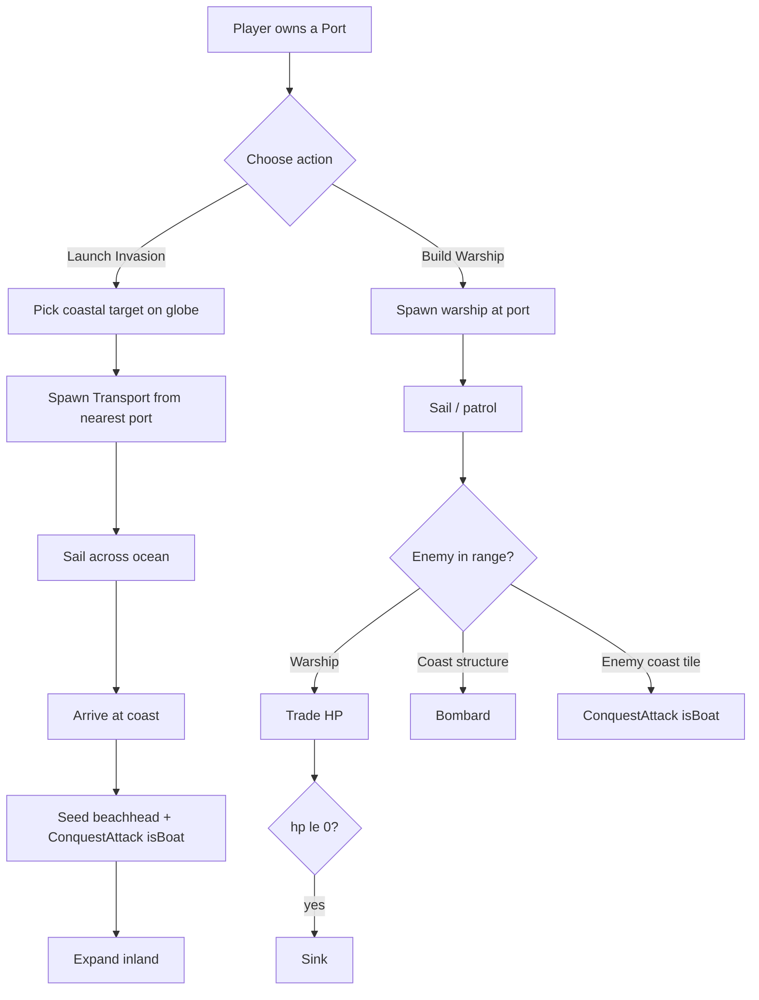

# Naval System — Architecture Plan

Goal: full naval warfare — **transports** (invade across water) + **warships** (fight at sea / bombard coast), launched from **ports**.

## Existing assets we reuse
- `port` structure already exists ([`SDEFS.port`](src/data/constants.js:229), cost 400).
- [`ConquestAttack`](src/core/conquest.js:978) already has `isBoat` + `{srcLat,srcLon,dstLat,dstLon,troops,ctx}` → transports seed beachheads by reusing the conquest engine.
- Movement model: [`TradeShip`](src/main.js:406) / [`TroopCohort`](src/main.js:644) slerp along great-circle, `progress 0→1`, ticked in [`loop()`](src/main.js:4919).
- AI already has a primitive boat attack ([Strategy D](src/main.js:4768)) to formalize.
- Click handler ([line 3751](src/main.js:3751)) + command panel `bp` + [`rebuildRosters()`](src/main.js:5118) for UI.
- Netcode: `sendAction` / `applyOpponentAction`.

## Data model
- New array `navalUnits = []` (line ~1762 next to `tradeShips`).
- New class `NavyUnit` (near `TradeShip`):
  - `kind: 'transport' | 'warship'`, `owner`, `troops` (transport), `hp/maxHp` (warship).
  - `startVec/targetVec`, `progress`, `speed`, `dead`, `mesh`.
  - `update()` → move by slerp; on event act (see below).

## Behavior

### Transport (invasion)
- Launched from nearest owned port → player-picked coastal/land target.
- Carries `troops` (capped by `TRANSPORT_TROOP_CAP`), deducted from owner pool.
- On arrival: find nearest land cell to dst → `conquestGrid.seedCircle(dstLat,dstLon,R,owner)` → `activeAttacks.push(new ConquestAttack({grid,owner,target,troops,srcLat,srcLon,dstLat,dstLon,ctx,isBoat:true}))`. Ship consumed.

### Warship (combat)
- Built at a port (cost `WARSHIP_COST`), has `hp`.
- Each tick: bombard enemy structures/troops within `WARSHIP_RANGE` (deal `WARSHIP_DMG`); conquer adjacent enemy/neutral coastal tiles (small `isBoat` expansion); trade HP with enemy warships in range. Sinks at hp≤0 (explosion fx).
- Coastal defenses (sam/flak/iron_dome) acquire warships as valid targets.

## Constants (GAME_CONSTANTS)
`TRANSPORT_COST`, `TRANSPORT_TROOP_CAP`, `TRANSPORT_SPEED`, `WARSHIP_COST`, `WARSHIP_HP`, `WARSHIP_SPEED`, `WARSHIP_RANGE`, `WARSHIP_DMG`, `NAVAL_BEACHHEAD_RADIUS`.

## Player UI (command panel `bp`)
Adds an **8th tab** to `#cmdTabs` (indices 0-6 exist: Missiles/Build/Air/Research/Drones/Defense/Conquest):
`<button class="cmdTab" onclick="openCmdTab(7, this, '.g-pane')">🚢 بحري</button>`
plus a matching 8th `
` pane.

**Naval pane layout** (matches existing Arabic/styled `.btn` / `.srow` / `pct-btn` conventions):
- **Status line** `#navalStatus`: "الموانئ: N | القوات: T" (ports owned | available troops) — refreshed each frame.
- **Build Warship** `.btn` (cost `WARSHIP_COST`): spawns a warship at the nearest owned port. Greyed/no-op + `#navalMsg` warning if no port or insufficient gold.
- **Launch Invasion** `.btn red`: sets `navalMode='transport'`; `#navalMsg` → "انقر على ساحل عدو للإنزال" (click an enemy coast to land).
- **Troop % selector**: reuse the Conquest tab's `pct-btn` row (10/25/50/75/100%) → sets `navalTroopPct` (how many of the player's troops the transport carries, capped by `TRANSPORT_TROOP_CAP`).
- **Message line** `#navalMsg`: feedback (errors, "sailing…", etc).

**Interaction flow:**
1. Player clicks 🚢 بحري tab → naval pane shows.
2. **Build Warship** → if owned port + gold ≥ cost: deduct gold, spawn warship at port (it sails/patrols automatically, engaging targets).
3. **Launch Invasion** → enters target-pick mode (`navalMode='transport'`).
4. Player clicks a coastal/land spot on the globe → click handler branch validates (must be land or near coast, ideally enemy/neutral), finds nearest owned port, deducts `navalTroopPct` troops, spawns a `NavyUnit` transport from that port → the target, `sendAction` for MP, clears mode.
5. Transport sails; on arrival seeds beachhead + `ConquestAttack(isBoat)` → expands inland.

**Mobile:** mirror the naval controls into `#mTab4` (or a new mobile tab) like the other command sets.

## Loop / cleanup
- `loop()`: `navalUnits = navalUnits.filter(u=>{u.update();return !u.dead;})`.
- Cleanup ([4311](src/main.js:4311)): dispose meshes, `navalUnits=[]`.

## AI
- Formalize Strategy D: if enemy has port + `eRes≥WARSHIP_COST` → build warship; if `eTroops` high + port → launch transport at player coast (replace raw TroopCohort boat attack).

## Multiplayer sync
- `sendAction({type:'naval',kind,owner,srcLat,srcLon,dstLat,dstLon,troops})`; `applyOpponentAction` mirrors.

## Flow

## Phased todos
1. Foundation: constants + `NavyUnit` class + `navalUnits` array + loop/cleanup wiring.
2. Transport beachhead mechanic (arrival → seedCircle + ConquestAttack isBoat).
3. Warship combat (hp, bombard, warship-vs-warship, coastal conquest).
4. Player UI: Naval tab + Build Warship + Launch Invasion + click handler.
5. Port integration (nearest-port launch, port requirement).
6. AI naval (build warships + launch transports).
7. Multiplayer sync (sendAction / applyOpponentAction).
8. Polish: ship meshes, HP bars, FX, balance tuning.
