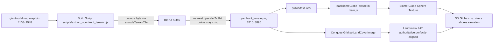

# Plan: Integrate OpenFront GiantWorldmap Terrain

## Problem
1. **Max-zoom blur** — the globe texture (photo-based) looks blurry/low-res when zoomed in.
2. **No rivers** — photo-based biome texture has no crisp rivers/lakes; OpenFront renders them sharply.

## Root Cause (confirmed by source analysis)
OpenFront's crisp terrain comes from a **custom elevation-encoded source image**, NOT a photo:
- `image.png` blue channel = elevation (140–200), transparency / blue=106 = water.
- Only the blue channel matters; red/green are ignored.
- Rivers are encoded as thin transparent/blue-106 strips → become crisp Water tiles.

The `.bin` is the fully-processed terrain (after island removal, water-body classification, shoreline detection, ocean marking, distance-to-land BFS). It is the authoritative terrain dataset.

## OpenFront Binary Format (verified)
- File: `resources/maps/giantworldmap/map.bin`
- Dimensions: **4108 × 1948** (from `manifest.json` → `map.width/height`)
- Layout: **1 byte per tile**, row-major `index = y * width + x`
  - (genTerrainFromBin checks `data.length === width * height`; a possible 4-byte header must be verified by file size at implementation time)
- Per-byte bitfield:
  - `bit 7 (0x80)` — isLand
  - `bit 6 (0x40)` — isShoreline
  - `bit 5 (0x20)` — isOcean (water only)
  - `bits 0–4 (0x1f)` — magnitude (0–31); Land=elevation, Water=distance-to-land/2

## OpenFront Color Algorithm (encodeTerrainTile — single source of truth)
| Condition | Color (R,G,B) |
|---|---|
| Land + shoreline (sand) | (204, 203, 158) |
| Land, plains (mag < 10) | (190, 220−2·mag, 138) green |
| Land, highland (mag < 20) | (200+2·mag, 183+2·mag, 138+2·mag) tan |
| Land, mountain (mag ≥ 20) | (230+⌊mag/2⌋) grayscale |
| Water + shoreline | (100, 143, 255) light blue |
| Water, deep | oceanColor darkened by min(mag,10) |

## Architecture

## Implementation Steps

### Step 1 — Build script: `scripts/extract_openfront_terrain.cjs`
- Read `OpenFrontIO-main/resources/maps/giantworldmap/map.bin`.
- Verify byte length: if `=== 4108*1948` → headerless; if `=== 4108*1948 + 4` → skip 4-byte header.
- For each byte, apply `encodeTerrainTile()` logic → RGBA.
- Optional nearest-neighbor 2× upscale (8216×3896) — flat colors upscale crisply, fills GPU texture budget, improves max-zoom.
- Encode PNG (use `pngjs` or canvas) → `public/textures/openfront_terrain.png`.

### Step 2 — Projection / extent verification
- Check whether 4108×1948 maps cleanly to lon −180..180 / lat 90..−90.
- Aspect ratio ≈ 2.11 (slightly wider than 2:1) → may need calibration.
- Fallback: calibrate lon/lat extent from nation coordinates in `manifest.json` (known real-world lat/lon of countries) → affine remap into a clean equirectangular frame when generating the PNG.
- For first pass: assume approximately equirectangular; revisit only if continents look shifted vs. city/conquest positions.

### Step 3 — Switch globe texture source (`src/main.js`)
- `LAND_COVER_URLS`: put `textures/openfront_terrain.png` first.
- `loadBiomeGlobeTexture()`: load the OpenFront PNG; keep `NearestFilter` mag + `NearestMipmapNearestFilter` min (flat colors).
- The existing `quantizeBiomePixel()` pass becomes a no-op / can be skipped (texture is already flat-color), but harmless to keep.

### Step 4 — Conquest grid land mask from OpenFront raster (`src/core/conquest.js`)
- `setLandCoverImage(img)` / `buildLandMaskFromImageData()`: classify water vs land.
- With OpenFront raster this is authoritative: water pixels (blue) → water, land pixels (green/tan/gray/sand) → land.
- Result: territory painting aligns perfectly with the visual coastline.

### Step 5 — (Optional) Biome recoloring
- **Option A (pure OpenFront):** keep OpenFront's exact green/tan/gray/blue palette. Simplest, exactly matches what the user referenced.
- **Option B (hybrid biomes):** for LAND tiles, sample the old earth photo at matching lat/lon to recover forest/desert/snow/plains variation, while keeping OpenFront's crisp water/shoreline. Richer but needs projection alignment between the two sources.

### Step 6 — Test
- Rivers (Nile, Amazon, Mississippi) render as crisp blue lines.
- Lakes and shorelines are sharp.
- Territory fills + vector borders align with coastline.
- Zoom in: flat colors stay clean (no photo blur).

## Decisions for User
1. **Color palette:** Option A (pure OpenFront green/tan/gray) vs Option B (OpenFront water + photo biomes on land)?
2. **Upscale:** nearest-neighbor 2× to 8K for better max-zoom fill? (recommended, free for flat colors)

## Risk Notes
- Projection: giantworldmap aspect 2.11 ≠ 2.0; if cities look offset from coastlines, add calibration/remap in Step 2.
- No forest/desert/snow in pure OpenFront terrain (only elevation-based plains/highland/mountain).
- Texture memory: 8K RGBA ≈ 256 MB if uncompressed on GPU; use JPG or GPU-compressed format if memory-constrained.
